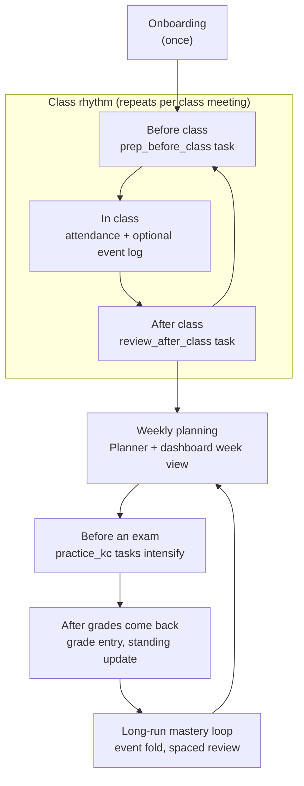
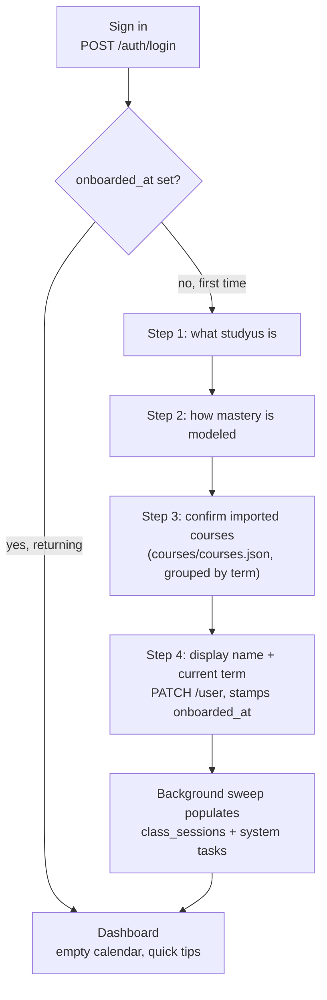
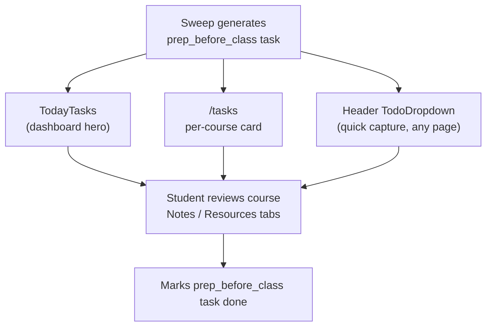
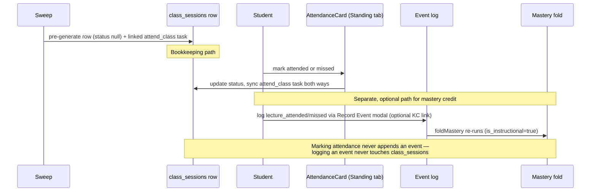
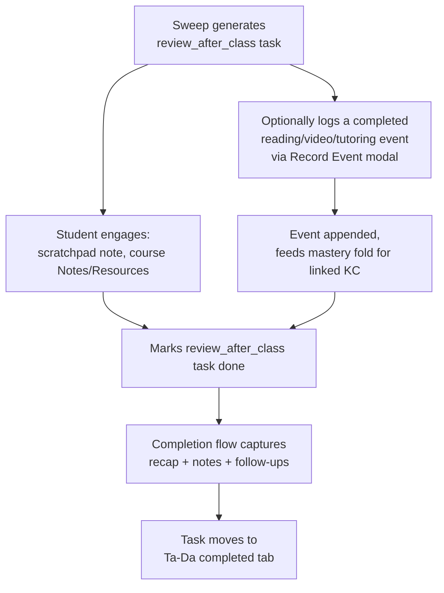
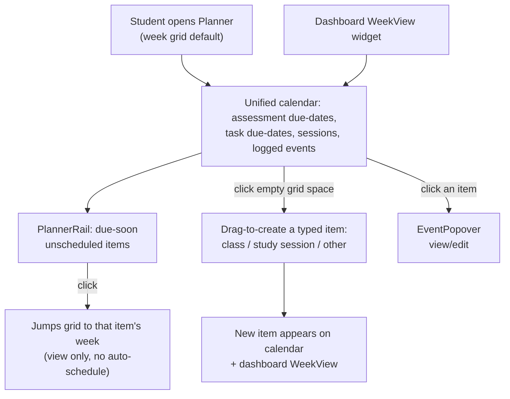
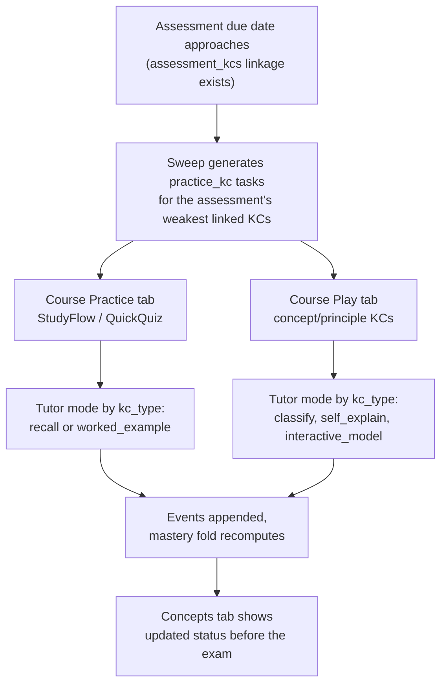
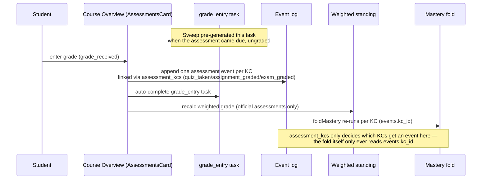
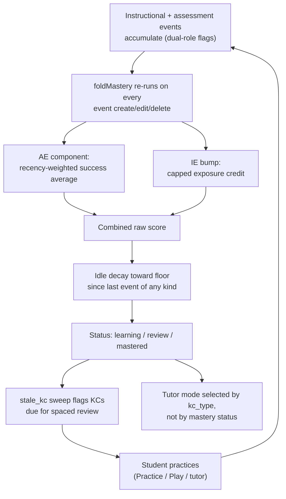
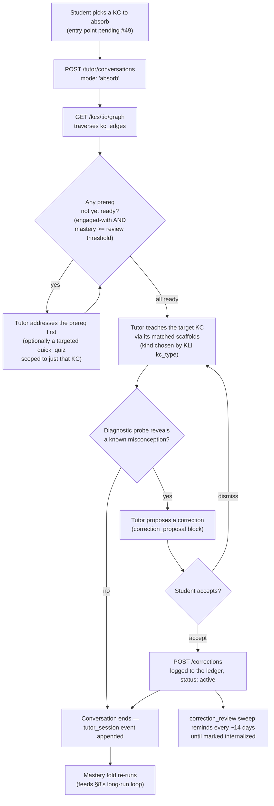

# Student Lifecycle in studyus

This doc traces the situations a student moves through over a term and which studyus surface serves each one. It assumes the KLI ontology from `docs/architecture/events-and-mastery.md` (KCs, dual-role instructional/assessment events, the mastery fold) and the entry points from `docs/product/user-journeys.md` — read those first if a diagram here seems to skip a step. Diagrams are GitHub-native `mermaid` fences; nothing else in this repo renders mermaid today, so this doc establishes the convention.

## Overview: The Full Loop

Onboarding happens once. After that, the student's time is organized by a fast daily/class-meeting rhythm (before → in → after class), a slower weekly planning cadence, periodic intensification before each exam, and a reflection step after each grade posts. All of it feeds — and is fed by — one continuous mastery loop running underneath. The cadences differ (class meetings happen several times a week, planning weekly, exams periodically, mastery continuously); this diagram is a narrative arc through them, not a strict pipeline.

A ninth situation — **absorbing a new KC** (§9, v1.7) — runs orthogonally to this cadence rather than slotting into one point on it: a student can reach for it any time they want to actually *understand* a topic (not just drill it), triggered by curiosity, an upcoming exam, or a KC flagged not-yet-`ready` during another absorb session's own prerequisite check. It feeds into the same long-run mastery loop (§8) as everything else — an absorb conversation still appends a `tutor_session` event on close.

## 1. Onboarding

A first-time sign-in walks the student from an empty account to a personalized, populated workspace. The goal is confidence in what a "knowledge component" is and a workspace pre-loaded with their real courses, not a blank slate. Surfaces: `OnboardingFlow` (Svelte stepper), the seeded `courses/courses.json` catalog, and the background sweep that turns a confirmed course list into a working calendar.

## 2. Before Class

The gap before a scheduled class meeting; the goal is to walk in prepared rather than cold. The sweep's `prep_before_class` generator surfaces the same task across every checkable-task surface, and the student closes the loop on a course's Notes/Resources tabs.

## 3. In Class: Attendance vs. Mastery Credit

Attendance bookkeeping and mastery credit are **two independent mechanisms** — a consistency point worth being explicit about. The sweep pre-generates a `class_sessions` row per scheduled meeting day (from `courses.meeting_days`), and marking it `attended`/`missed` on the course's Standing tab (`AttendanceCard`) two-way-syncs the linked `attend_class` task. Separately, and optionally, the student can log a `lecture_attended`/`lecture_missed` event via the header's Record Event modal (with an optional KC link) — this is the path that actually feeds the mastery fold. Marking a session attended does not append an event, and logging an event does not touch `class_sessions` or the task.

## 4. After Class

The consolidation window right after a lecture: capture what happened, then optionally start turning it into mastery credit. The sweep's `review_after_class` task anchors this; notes/resources capture and the Record Event modal cover the rest. Completing the task runs through the typed-task completion flow (recap, notes, follow-ups) and the task lands in the "Ta-Da" completed tab.

## 5. Weekly Planning

The step-back view: what's due, what's scheduled, and where to slot study time this week. `/planner`'s unified calendar (week grid by default, toggleable to month/agenda) is the hub; the dashboard's `WeekView` widget mirrors it in miniature. `PlannerRail` surfaces unscheduled due-soon items but — per `docs/todo.md`'s deferral list — clicking one only jumps the grid to that week, it doesn't auto-schedule; scheduling itself now happens by dragging directly on the grid to create a typed item (class / study session / other).

## 6. Before an Exam

As an assessment's due date approaches, review sharpens toward the KCs it actually covers. The `practice_kc` sweep generator ties an ungraded assessment to its lowest-mastery linked KCs (via `assessment_kcs`, the "Concepts covered" picker on `AssessmentsCard`) and the student works them through the course's Practice or Play tab, with the tutor's mode chosen by `kc_type` rather than by mastery level.

## 7. After Grades Come Back

A grade posts, and three things follow from one action: the linked `grade_entry` task auto-completes, the course's weighted standing (official assessments only) recalculates, and — this is the subtlety — the mastery fold updates only because grade entry fans out into one assessment event *per linked KC* at write time. `assessment_kcs` decides which KCs get an event here; `foldMastery` itself still only ever reads `events.kc_id`, never `assessment_kcs` directly, so this doesn't contradict the "unconsumed `qmatrix_version`" note in `docs/architecture/events-and-mastery.md`. Grade entry works the same way whether it comes from the course Overview's inline entry or the header's Record Event modal — both funnel through `PATCH /assessments/:id`.

## 8. The Long-Run Mastery Loop

Underneath every situation above, the same fold is always running: every instructional/assessment event re-runs `foldMastery` for its KC, and the result decides both what the tutor does next and what the sweep resurfaces. Tutor mode is selected by `kc_type`, not by mastery status — a `fact` KC always gets spaced retrieval regardless of where its mastery sits.

## 9. Absorbing a New KC (Guided Understanding)

Distinct from the class-meeting rhythm above: any time a student wants to *understand* a KC rather than just drill it, they can absorb it. The raw material comes from `courses/<slug>/content.json` (frozen contract: `courses/content-schema.md`), seeded across all 9 current-term courses: 147 KCs (all five KLI types represented — e.g. CHEE 314 alone has 1 fact, 5 concept, 7 rule, 4 principle, and 1 association KC), 187 prerequisite edges (`kc_edges`) including cross-course chains — CHEE 314's "Dimensional analysis and the Buckingham Pi theorem" is itself a prerequisite for two CHEE 315 KCs, and CHEE 314's "Bernoulli equation" requires a MATH 264 calculus KC first — 297 scaffolds (worked examples, retrieval prompts, and 9 other KLI-grounded kinds; `rule` KCs like Buckingham Pi get a full support-fading ladder, the same worked example at levels 1→2→3), and 42 misconceptions with a diagnostic probe and a standalone corrected statement each (e.g. Bernoulli's equation has two documented ones, grounded in physics-education-research literature, not guessed).

Entry point: <!-- pending #49 -->.

The corrections ledger is a first-class, revisitable asset — "things I used to believe and have corrected" — not a line buried in a chat transcript. A correction stays `active` (and keeps getting the spaced reminder) until the student marks it `internalized`.

## Planned Extensions (Not Yet Shipped)

Two surfaces would extend this lifecycle but aren't built: **Flue agentic channels** (a bus-quiz flow over Telegram/SMS, letting practice happen off-app — fully specced in `docs/architecture/agentic-channels.md`, post-v1 experimental) and an **iPad client** (native app reusing the frozen API contract). Neither is reachable in the app as of 2026-08-15.
